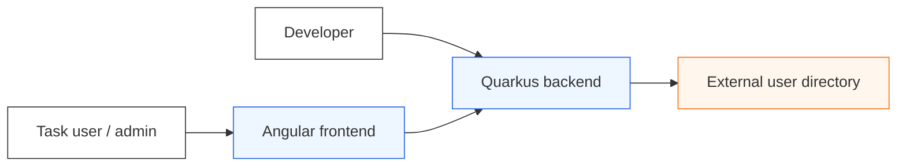
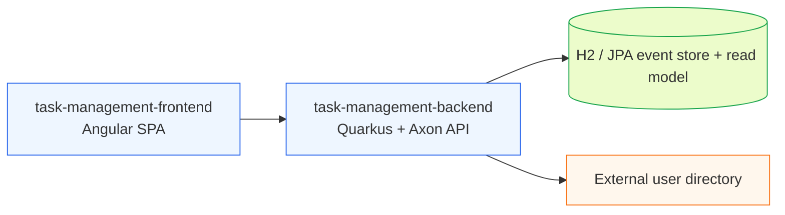
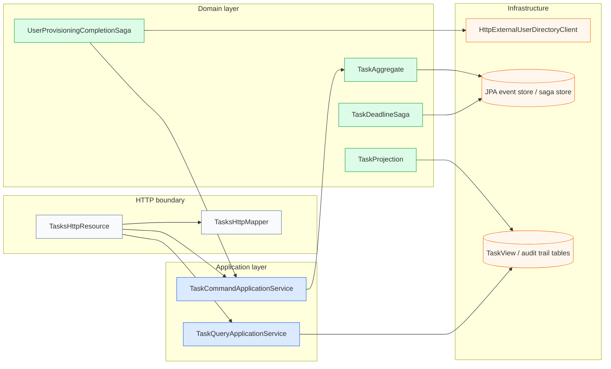

# Architecture

This project uses a CQRS/Event Sourcing backend with a thin HTTP boundary.

## C4 Context

## C4 Containers

## C4 Backend components

## Roles

- **Task user / admin**: works through the Angular UI.
- **Developer**: runs backend/frontend locally, changes code, and uses the docs.
- **External system**: user directory queried by the provisioning saga.
